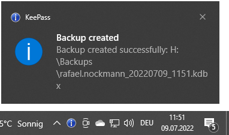

# KeePassAutoBackupPlugin
KeePassAutoBackupPlugin is a plugin for KeePass to automatically create backups of the KeePass database.

## Quick Start
1. First, download KeePassAutoBackupPlugin.
2. Then, extract the zip archive.
3. Put KeePassAutoBackupPlugin.dll and KeePassAutoBackupPlugin.dll.ini in your Plugins directory in KeePass installation directory.
4. Adjust KeePassAutoBackupPlugin.dll.ini to your needs.

## Download KeePassAutoBackupPlugin
You can either clone the Git project and compile KeePassAutoBackupPlugin from source or you can download the latest binary version from here: https://nocksoft.de/?smd_process_download=1&download_id=3118

## KeePass
KeePassAutoBackupPlugin is a plugin for KeePass (https://keepass.info/) for automatically backups.
KeePass is released under GNU General Public License and is available on its own homepage (https://keepass.info/download.html).
